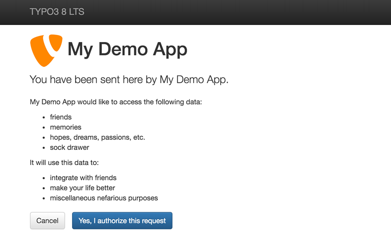

.. _start:

=======================
OAuth2 Server for TYPO3
=======================

This extension transforms your TYPO3 website into an OAuth2 server for any application you like.

It is based on the terrific `OAuth2 PHP library written by Brent Shaffer <http://bshaffer.github.io/oauth2-server-php-docs>`__.


Installation
============


1. Fetch the extension
----------------------

Either install as usual from TER or manually by cloning the Git project:

::

    $ cd /path/to/website/typo3conf/ext/
    $ git clone https://github.com/xperseguers/t3ext-csl_oauth2.git csl_oauth2
    $ cd csl_oauth2/Classes/
    $ composer install


2. Configure your web server
----------------------------

If you are using PHP fcgi, please add this to your :file:`.htaccess`:

.. code-block:: apache

    RewriteEngine On
    RewriteRule .* - [E=HTTP_AUTHORIZATION:%{HTTP:Authorization},L]


3. Create a client
------------------

Open TYPO3 module :menuselection:`Web --> List`, click on the root page of your TYPO3 install and create a new record of
type "OAuth2 Client".


4. OAuth2 endpoints
-------------------

The general URL to use for the OAuth2 workflow is:

    https://<www.typo3website-url.tld>/?eID=csl_oauth2&mode=<mode>&<additional-parameters>

where ``<mode>`` may be one of:

* ``authorize``: This starts the OAuth 2.0 authorization flow. This isn't really an API call — it's the web page that
  lets the user sign in to your TYPO3 website and authorize your app. After the user decides whether or not to authorize
  your app, they will be redirected to the URI specified by ``redirect_uri``.
* ``token``: This endpoint is sued to acquire a bearer token.


Mode ``authorize``
^^^^^^^^^^^^^^^^^^

.. important:: Method to invoke the URL: ``GET``.

OAuth 2.0 supports two authorization flows:

* The ``code`` flow returns a code via the ``redirect_uri`` callback which should then be converted into a bearer token
  using the ``token`` mode call. This is the recommended flow for apps that are running on a server.
* The ``token`` or implicit grant flow returns the bearer token via the ``redirect_uri`` callback, rather than
  requiring your app to make a second call to a server. This is useful for pure client-side apps, such as mobile apps or
  JavaScript-based apps.

For more information on the two flows, see
`Section 1.3 of the OAuth 2 spec <http://tools.ietf.org/html/rfc6749#section-1.3>`_.

================  =============================================================================================
Parameter         Value
================  =============================================================================================
response_type     *required* The grant type requested, either ``token`` or ```code``.
client_id         *required* The app's key, found in your record's configuration.
redirect_uri      Where to redirect the user after authorization has completed. This must be the exact URI
                  registered in your record's configuration. A redirect URI is required for a ``token`` flow,
                  but optional for ``code``. If the redirect URI is omitted, the ``code`` will be presented
                  directly to the user and they will be invited to enter the information in your app.
state             Up to 500 bytes of arbitrary data that will be passed back to your redirect URI. This
                  parameters should be used to protect against cross-site request forgery (CSRF). See sections
                  `4.4.1.8 <https://tools.ietf.org/html/rfc6819#section-4.4.1.8>`_ and
                  `4.4.2.5 <https://tools.ietf.org/html/rfc6819#section-4.4.2.5>`_  of the OAuth 2.0 threat
                  model spec.
================  =============================================================================================

This will show an authorization form where the user will be able to authenticate and confirm she wants to authorize your
client application to impersonate her on the TYPO3 website:



At the end of the process, your client application will be called back (using ``redirect_uri``) with a JSON response.


Mode ``token``
^^^^^^^^^^^^^^

.. important:: Method to invoke the URL: ``POST``.

This endpoint only applies to apps using the authorization code flow. An app calls this endpoint to acquire a bearer
token once the user has authorized the app.

Calls to ``token`` need to be authenticated using the apps's key and secret. These can either be passed as POST
parameters (see parameters below) or via
`HTTP basic authentication <https://www.wikiwand.com/en/Basic_access_authentication>`_. If basic authentication is used,
the app key should be provided as the username, and the app secret should be provided as the password.

================  =============================================================================================
Parameter         Value
================  =============================================================================================
code              *required* The code acquired by directing users to ``&mode=authorize&response_type=code``.
grant_type        *required* The grant type, which must be ``authorization_code``.
client_id         If credentials are passed in POST parameters, this parameter should be present and should be the app's
                  key, found in your record's configuration.
client_secret     If credentials are passed in POST parameters, this parameter should be present and should be the app's
                  secret, found in your record's configuration.
redirect_uri      Only used to validate that it matches the original value in ``&mode=authorize``, not used to redirect
                  again.
================  =============================================================================================

This returns a JSON-encoded dictionary including an access token (access_token), token type (token_type), user ID (uid).
The token type will always be "bearer".
